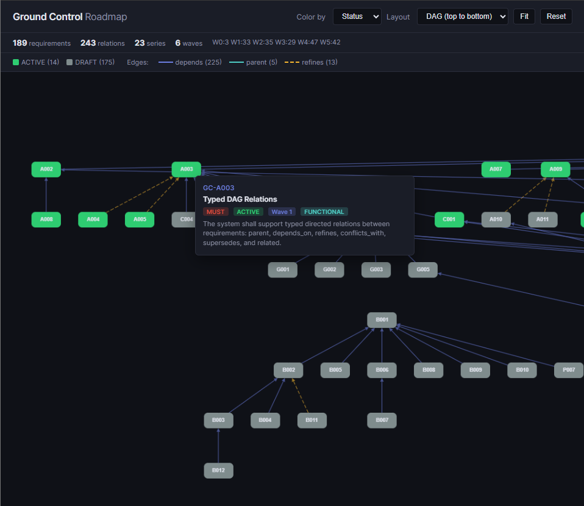

# Ground Control

[](https://github.com/KeplerOps/Ground-Control/actions/workflows/ci.yml)
[](https://sonarcloud.io/summary/new_code?id=KeplerOps_Ground-Control)

An automated software factory that connects requirements, code, controls, and
observability over a single data layer — with traceability throughout.

Ground Control unifies the software lifecycle into one graph-native platform.
Every artifact — requirement, code file, test, ADR, verification result,
security control — is a node. Every relationship is an edge. One query can
answer "which security requirements have no formal verification in the last
30 days?" or "what breaks if this interface changes?" No tool-hopping, no
stale spreadsheets, no traceability theater.

**Starting with requirements.** The requirements engine is live today: lifecycle
management, DAG-based dependency tracking, graph analysis, GitHub sync, and
MCP-driven AI workflows. The rest of the factory is coming.

<p align="center">
  
</p>

## What's Live

- **Requirements lifecycle** — DRAFT → ACTIVE → DEPRECATED → ARCHIVED, with MoSCoW priority and wave-based planning
- **Traceability links** — Connect requirements to GitHub issues, code files, tests, ADRs, verification results, and other artifacts
- **Graph analysis** — Cycle detection, orphan detection, coverage gaps, transitive impact analysis, cross-wave validation
- **Pluggable verification** — Prover-agnostic architecture for design-level (TLA+, Alloy) and code-level (OpenJML, Frama-C, Verus) verification, with results stored as first-class graph nodes
- **GitHub integration** — Sync issues into the traceability graph, or create issues from requirements with one command
- **StrictDoc import** — Bulk-import from `.sdoc` files, idempotent
- **ReqIF import** — Bulk-import from ReqIF 1.2 `.reqif` files (IBM DOORS, Polarion, Jama), idempotent
- **Text embeddings** — Pluggable vector embedding of requirement text with content-hash staleness detection, batch embedding, and graceful degradation when no provider is configured
- **Semantic similarity** — Pairwise cosine similarity analysis across requirement embeddings to detect near-duplicate requirements with configurable threshold
- **MCP server** — 30 tools for Claude Code: manage requirements, baselines, run analysis, embed text, and build traceability without leaving your editor
- **Baseline management** — Named point-in-time snapshots of the requirement set for release management and specification evolution tracking
- **Audit trail** — Every change to every entity is versioned via Hibernate Envers
- **Web UI** — React 19 / TypeScript SPA served by the backend: Dashboard, Requirements Explorer, Requirement Detail with local dependency graph

## Near-Term Roadmap

| Domain | What it adds |
|--------|-------------|
| **Risk management** | Risk register as graph nodes linked to requirements and controls; impact/likelihood scoring; risk-to-requirement traceability so you can see which risks are unmitigated |
| **Security** | Threat modeling artifacts connected to the requirement and verification graphs; security control tracking; compliance evidence generation for frameworks like ISO 27001 and SOC 2 |
| **Asset management** | Software asset inventory (services, libraries, infrastructure) as graph nodes; dependency mapping; change impact analysis that traces from a library upgrade through assets to affected requirements |

## Getting Started

**Prerequisites:** Java 21, Docker, Node.js 20+, `gh` CLI (for GitHub features)

```bash
git clone https://github.com/KeplerOps/Ground-Control.git
cd Ground-Control
cp .env.example .env

make up       # Start PostgreSQL 16 (Apache AGE)
make dev      # Spring Boot on http://localhost:8000
```

Then visit:

- **Web UI** — `http://localhost:8000/` (React SPA — Dashboard, Explorer, Dependency Graph)
- **API** — `http://localhost:8000/api/v1/requirements`
- **Swagger UI** — `http://localhost:8000/api/docs`
- **OpenAPI spec** — `http://localhost:8000/api/openapi.json`

For frontend development with hot reload:

```bash
make frontend-install   # Install Node dependencies (first time only)
make frontend-dev       # Vite dev server on http://localhost:5173 (proxies /api to :8000)
```

### MCP Server (Claude Code)

Configured in `.mcp.json`, works automatically with Claude Code. Start the
backend, then use tools like `gc_create_requirement`, `gc_analyze_cycles`, and
`gc_create_github_issue` from your conversation. See the
[MCP server docs](mcp/ground-control/README.md) for the full tool reference.

## Development

```bash
make rapid        # Format + compile (~1s warm) — inner dev loop
make test         # Unit tests
make check        # CI-equivalent: build + tests + static analysis + coverage
make integration  # Integration tests (Testcontainers, no external DB needed)
make verify       # Everything: check + integration + OpenJML ESC
```

Run `make help` to see all targets.

## Tech Stack

| | |
|---|---|
| **Runtime** | Java 21 / Spring Boot 3.4 / Gradle |
| **Frontend** | React 19 / TypeScript 5 / Vite 6 / Tailwind 4 |
| **Database** | PostgreSQL 16 + Apache AGE (optional graph queries) |
| **Migrations** | Flyway |
| **Auditing** | Hibernate Envers |
| **Testing** | JUnit 5, jqwik (property-based), ArchUnit, Testcontainers |
| **Static analysis** | Spotless, Error Prone, SpotBugs, Checkstyle, JaCoCo |
| **Formal methods** | JML + OpenJML ESC + Z3 |
| **CI/CD** | GitHub Actions → GHCR |
| **Quality** | SonarCloud |

## Architecture

```
api/ → domain/ ← infrastructure/
```

The domain layer has zero Spring web imports. Controllers depend on domain
services; infrastructure adapters implement domain interfaces. Enforced at
compile time by ArchUnit.

```
com.keplerops.groundcontrol/
├── api/               Controllers, DTOs, exception handling
├── domain/            Entities, services, enums, repository interfaces
├── infrastructure/    AGE graph, GitHub CLI, embedding provider adapters
└── shared/            Request logging, MDC
```

## Documentation

| Document | Description |
|----------|-------------|
| [API Reference](docs/API.md) | REST endpoints, filtering, pagination, error format |
| [Architecture](docs/architecture/ARCHITECTURE.md) | Package structure, dependency rules |
| [Coding Standards](docs/CODING_STANDARDS.md) | Style, testing policy, assurance levels |
| [Deployment](docs/deployment/DEPLOYMENT.md) | Setup, Docker, CI/CD pipeline |
| [MCP Server](mcp/ground-control/README.md) | Tool reference, workflows |
| [ADRs](architecture/adrs/) | Architecture Decision Records |
| [Contributing](CONTRIBUTING.md) | Setup, workflow, PR process |
| [Changelog](CHANGELOG.md) | Release history |

## License

[MIT](LICENSE)
