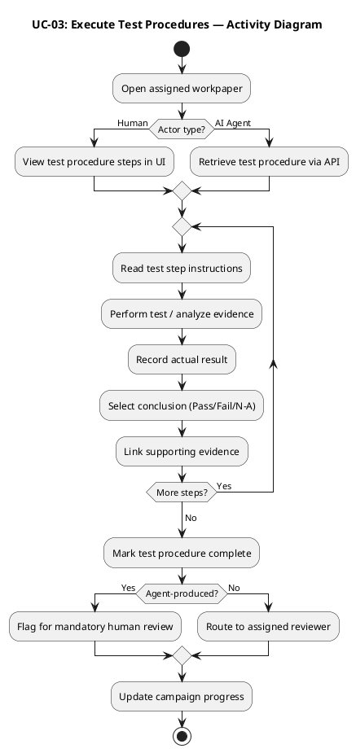
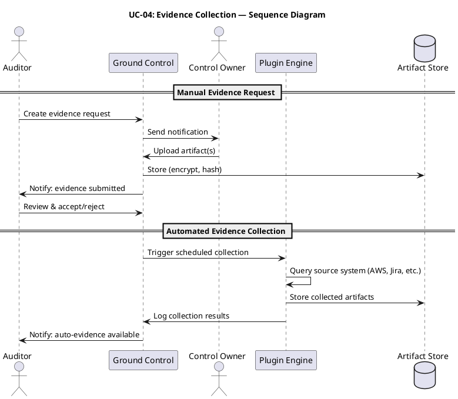
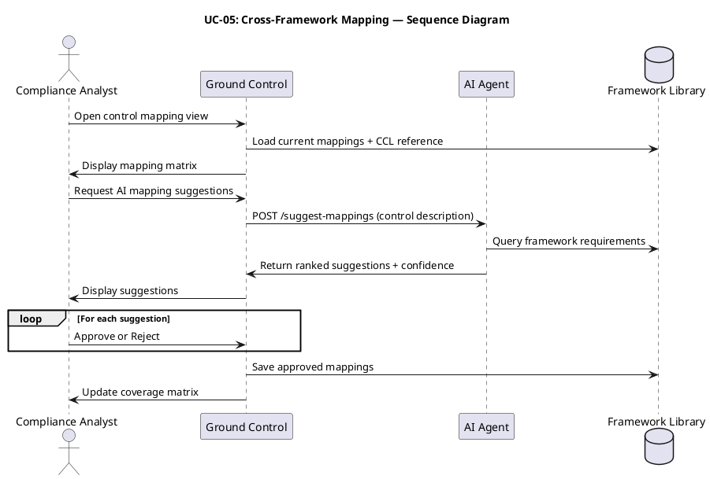
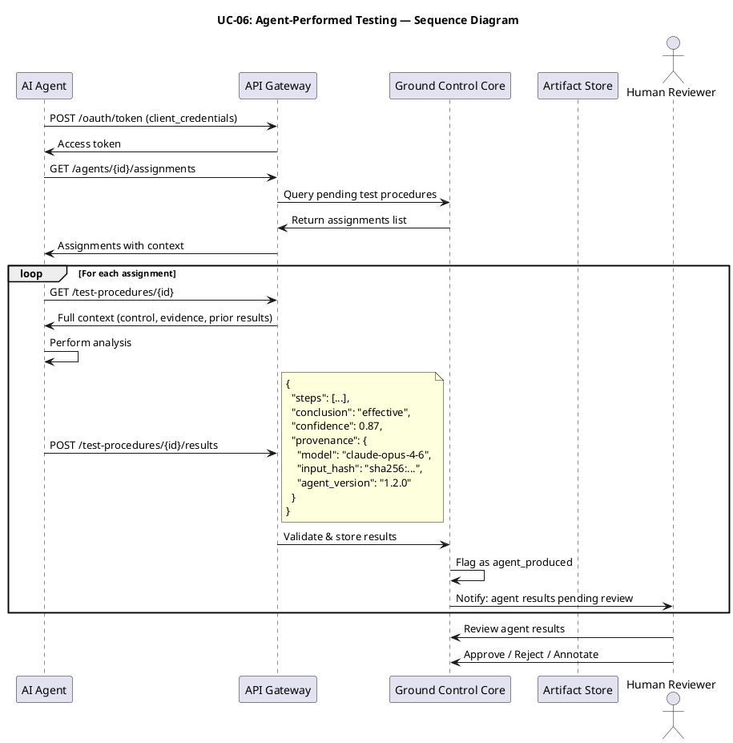
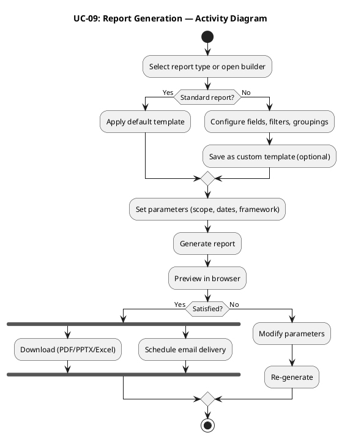

# Ground Control — Use Cases (UML)

**Version:** 1.0.0
**Date:** 2026-03-07

This document describes system use cases with PlantUML-compatible diagrams.

---

## 1. System Use Case Overview

```plantuml
@startuml
left to right direction
skinparam actorStyle awesome

actor "IT Risk Manager" as RM
actor "Internal Auditor" as IA
actor "Control Owner" as CO
actor "Compliance Analyst" as CA
actor "CISO / Executive" as EX
actor "AI Agent" as AG
actor "Platform Admin" as PA

rectangle "Ground Control" {
  package "Risk Management" {
    usecase "Manage Risk Register" as UC_RR
    usecase "Run Risk Assessment" as UC_RA
    usecase "Define Risk Appetite" as UC_AP
    usecase "Track Treatment Plans" as UC_TP
    usecase "View Risk Dashboard" as UC_RD
  }

  package "Control Management" {
    usecase "Manage Control Catalog" as UC_CC
    usecase "Map Controls to Frameworks" as UC_CF
    usecase "Browse Common Control Library" as UC_CL
  }

  package "Assessment & Testing" {
    usecase "Plan Assessment Campaign" as UC_AC
    usecase "Execute Test Procedures" as UC_ET
    usecase "Collect Evidence" as UC_CE
    usecase "Review Workpapers" as UC_RW
    usecase "Agent-Performed Testing" as UC_AT
  }

  package "Evidence Management" {
    usecase "Upload Artifacts" as UC_UA
    usecase "Link Evidence" as UC_LE
    usecase "Auto-Collect Evidence" as UC_AE
    usecase "View Evidence Lineage" as UC_VL
  }

  package "Findings & Remediation" {
    usecase "Record Findings" as UC_RF
    usecase "Manage Remediation" as UC_MR
    usecase "Validate Remediation" as UC_VR
  }

  package "Reporting" {
    usecase "Generate Executive Reports" as UC_ER
    usecase "Build Custom Reports" as UC_CR
    usecase "API Analytics" as UC_AA
  }

  package "Administration" {
    usecase "Configure SSO" as UC_SS
    usecase "Manage Users & Roles" as UC_UR
    usecase "Install Plugins" as UC_IP
    usecase "View Audit Logs" as UC_AL
    usecase "Configure Taxonomy" as UC_CT
    usecase "Register Agents" as UC_AG
  }
}

' Risk Management
RM --> UC_RR
RM --> UC_RA
RM --> UC_TP
RM --> UC_RD
EX --> UC_AP
EX --> UC_RD

' Control Management
IA --> UC_CC
CA --> UC_CF
CA --> UC_CL

' Assessment & Testing
IA --> UC_AC
IA --> UC_ET
IA --> UC_CE
IA --> UC_RW
AG --> UC_AT

' Evidence Management
CO --> UC_UA
IA --> UC_LE
AG --> UC_AE
IA --> UC_VL

' Findings & Remediation
IA --> UC_RF
CO --> UC_MR
IA --> UC_VR

' Reporting
EX --> UC_ER
RM --> UC_CR
AG --> UC_AA

' Administration
PA --> UC_SS
PA --> UC_UR
PA --> UC_IP
PA --> UC_AL
PA --> UC_CT
PA --> UC_AG

@enduml
```

---

## 2. Detailed Use Cases

### UC-01: Manage Risk Register

| Field | Value |
|---|---|
| **Name** | Manage Risk Register |
| **Primary Actor** | IT Risk Manager |
| **Stakeholders** | CISO, Control Owners, Auditors |
| **Precondition** | User has Risk Manager role; taxonomy is configured |
| **Postcondition** | Risk register is updated; changes are audit-logged |
| **Trigger** | User navigates to Risk Register or API call |

**Main Success Scenario:**
1. Actor opens the risk register view.
2. System displays list of risks with filters (category, rating, owner, status).
3. Actor creates a new risk entry, filling in required fields.
4. System validates input against configured taxonomy and saves.
5. System logs the creation event in the audit trail.
6. Actor optionally links the risk to business units, systems, and controls.

**Extensions:**
- 3a. Actor imports risks from CSV/JSON → system validates each row, reports errors, imports valid rows.
- 4a. Validation fails → system displays field-level errors, actor corrects.
- 6a. Actor archives a risk → system prompts for reason, soft-deletes, logs.

---

### UC-02: Run Risk Assessment Campaign

| Field | Value |
|---|---|
| **Name** | Run Risk Assessment Campaign |
| **Primary Actor** | IT Risk Manager |
| **Stakeholders** | Risk Assessors, CISO |
| **Precondition** | Risk register has risks; assessors are provisioned |
| **Postcondition** | All in-scope risks are reassessed; campaign is finalized |
| **Trigger** | Periodic schedule or manual initiation |

**Main Success Scenario:**
1. Actor creates a new campaign (name, scope, dates, scoring methodology).
2. System populates the campaign with in-scope risks based on filters.
3. Actor assigns risks to individual assessors.
4. System notifies assessors of their assignments.
5. Assessors open each assigned risk and update scores with justification.
6. Assessors link supporting evidence to their assessments.
7. Actor reviews campaign progress on the dashboard.
8. Actor finalizes the campaign; system locks all assessments.
9. System generates comparison report (prior period vs. current).

**Extensions:**
- 5a. Assessor disagrees with risk categorization → adds comment, flags for Risk Manager review.
- 8a. Incomplete assessments exist → system blocks finalization, lists incomplete items.

---

### UC-03: Execute Test Procedures

| Field | Value |
|---|---|
| **Name** | Execute Test Procedures |
| **Primary Actor** | Internal Auditor (or AI Agent) |
| **Stakeholders** | Audit Manager (reviewer), Control Owners |
| **Precondition** | Assessment campaign is active; test procedures exist |
| **Postcondition** | Test results recorded; workpaper ready for review |
| **Trigger** | Auditor opens assigned workpaper |

**Main Success Scenario:**
1. Actor opens the workpaper for an assigned control.
2. System displays the test procedure with ordered steps.
3. For each step, actor performs the test and records:
   a. Actual result observed
   b. Pass / Fail / N-A conclusion
   c. Links to supporting evidence
   d. Notes or screenshots
4. Actor marks the test procedure as complete.
5. System updates control status and rolls up to campaign progress.
6. System routes the workpaper to the assigned reviewer.

**Extensions:**
- 1a. Actor is an AI Agent → authenticates via API, retrieves test procedure via `GET /api/v1/test-procedures/{id}`.
- 3a. Agent submits results via `POST /api/v1/test-procedures/{id}/results` with structured payload.
- 3b. Agent results include provenance metadata and confidence score.
- 6a. Agent-produced results are auto-flagged for mandatory human review.

---

### UC-04: Collect Evidence

| Field | Value |
|---|---|
| **Name** | Collect Evidence |
| **Primary Actor** | Internal Auditor (requester) / Control Owner (provider) |
| **Stakeholders** | Audit Manager |
| **Precondition** | Assessment is active; control owner is provisioned |
| **Postcondition** | Evidence artifacts are uploaded and linked |
| **Trigger** | Auditor creates evidence request |

**Main Success Scenario:**
1. Auditor creates an evidence request specifying: what's needed, format, due date.
2. System sends notification to the Control Owner.
3. Control Owner opens their evidence request portal.
4. Control Owner uploads requested artifacts.
5. System hashes artifacts, encrypts at rest, links to the request.
6. Auditor receives notification of submission.
7. Auditor reviews and accepts the evidence (or rejects with comments).

**Extensions:**
- 2a. Automated collection plugin → system runs plugin on schedule, uploads artifacts automatically.
- 4a. Owner uploads wrong format → system warns but accepts (auditor can reject later).
- 5a. Overdue deadline → system sends escalation to Control Owner and their manager.

---

### UC-05: Cross-Framework Control Mapping

| Field | Value |
|---|---|
| **Name** | Cross-Framework Control Mapping |
| **Primary Actor** | Compliance Analyst |
| **Supporting Actor** | AI Agent (suggestion) |
| **Precondition** | Control exists; framework libraries are loaded |
| **Postcondition** | Control is mapped to relevant framework requirements |
| **Trigger** | New control created or framework added |

**Main Success Scenario:**
1. Analyst opens a control's framework mapping view.
2. System displays current mappings and the CCL reference mapping.
3. Analyst searches for framework requirements to map.
4. Analyst adds mappings with a relevance note.
5. System validates no circular or duplicate mappings.
6. System updates the coverage matrix.

**Extensions:**
- 2a. Analyst requests AI suggestions → system calls agent endpoint.
- 2b. Agent returns ranked suggestions with confidence scores.
- 4a. Analyst approves/rejects each suggestion → approved ones become mappings.

---

### UC-06: Agent-Performed Testing

| Field | Value |
|---|---|
| **Name** | Agent-Performed Testing |
| **Primary Actor** | AI Assessment Agent |
| **Stakeholders** | Internal Auditor (reviewer), Audit Manager |
| **Precondition** | Agent is registered; test procedures are assigned |
| **Postcondition** | Structured results submitted; routed for human review |
| **Trigger** | Agent polls for assignments or receives webhook |

**Main Success Scenario:**
1. Agent authenticates via OAuth2 client credentials.
2. Agent queries `GET /api/v1/agents/{id}/assignments` for pending work.
3. For each assignment, agent retrieves full test procedure context.
4. Agent performs analysis (evidence review, configuration check, etc.).
5. Agent submits structured results via API with provenance metadata.
6. System validates result schema, records provenance, flags for review.
7. Human reviewer receives notification.
8. Reviewer approves, rejects, or annotates agent results.

---

### UC-07: Configure SSO and Provision Users

| Field | Value |
|---|---|
| **Name** | Configure SSO and Provision Users |
| **Primary Actor** | Platform Administrator |
| **Precondition** | Admin has administrator role; IdP is available |
| **Postcondition** | SSO is configured; users authenticate via IdP |
| **Trigger** | Initial setup or IdP change |

**Main Success Scenario:**
1. Admin navigates to SSO configuration.
2. Admin selects protocol (SAML 2.0 or OIDC).
3. Admin enters IdP metadata (entity ID, endpoints, certificate / issuer, client ID).
4. System generates SP metadata / redirect URI for the IdP.
5. Admin configures the IdP with SP details.
6. Admin tests SSO login flow.
7. System confirms successful authentication.
8. Admin enables SSO enforcement.
9. Admin configures SCIM endpoint for automated provisioning.
10. IdP syncs users and groups to Ground Control.

**Extensions:**
- 6a. Test fails → system shows error details (certificate mismatch, clock skew, attribute mapping).
- 9a. No SCIM available → admin enables JIT provisioning (auto-create on first login).

---

### UC-08: Install and Configure Plugin

| Field | Value |
|---|---|
| **Name** | Install and Configure Plugin |
| **Primary Actor** | Platform Administrator |
| **Precondition** | Admin has administrator role |
| **Postcondition** | Plugin is installed and operational |
| **Trigger** | Need for new integration or framework |

**Main Success Scenario:**
1. Admin opens plugin catalog.
2. Admin browses or searches for desired plugin.
3. Admin reviews plugin details (description, permissions, version, author).
4. Admin installs the plugin.
5. System validates plugin signature and compatibility.
6. System renders plugin configuration UI from its schema.
7. Admin provides configuration values (API keys, endpoints, scopes).
8. Admin enables the plugin.
9. System runs plugin health check and confirms operational status.

**Extensions:**
- 5a. Signature validation fails → system blocks installation, alerts admin.
- 9a. Health check fails → system displays error, plugin remains disabled.

---

### UC-09: Generate Compliance Report

| Field | Value |
|---|---|
| **Name** | Generate Compliance Report |
| **Primary Actor** | CISO / IT Risk Manager |
| **Precondition** | Assessment data exists |
| **Postcondition** | Report is generated and available for download/delivery |
| **Trigger** | Manual request or scheduled trigger |

**Main Success Scenario:**
1. Actor selects report type (or opens report builder).
2. Actor configures parameters (scope, date range, framework, format).
3. System queries relevant data and generates the report.
4. Actor previews the report in-browser.
5. Actor downloads (PDF/PPTX/Excel) or schedules for email delivery.

---

## 3. Use Case — Actor Matrix

| Use Case | Risk Mgr | Auditor | Control Owner | Compliance | CISO | AI Agent | Admin |
|---|---|---|---|---|---|---|---|
| Manage Risk Register | **P** | R | | | R | | |
| Run Risk Assessment | **P** | | | | R | S | |
| Execute Test Procedures | | **P** | | | | **P** | |
| Collect Evidence | | **P** | **P** | | | S | |
| Cross-Framework Mapping | | | | **P** | | S | |
| Record Findings | | **P** | | | | S | |
| Manage Remediation | | R | **P** | | | | |
| Generate Reports | **P** | R | | R | **P** | S | |
| Configure SSO | | | | | | | **P** |
| Manage Users & Roles | | | | | | | **P** |
| Install Plugins | | | | | | | **P** |
| Register Agents | | | | | | | **P** |

**P** = Primary Actor, **R** = Reader/Consumer, **S** = Supporting Actor
