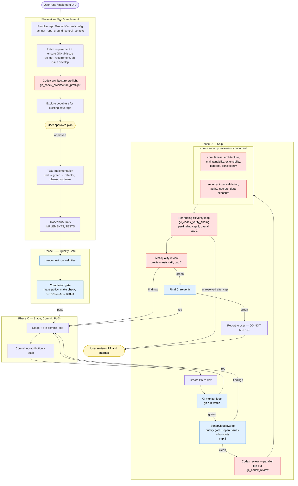

# Development Workflow

This documents the automated development workflow using Claude Code with the `/implement` skill. The workflow takes a Ground Control requirement from plan through PR-ready with a single skill invocation.

## Prerequisites

### GPG Signing
- GPG key `B47C8B1F62CC2B54` has no passphrase (removed 2026-03-31)
- Commits are signed non-interactively by Claude Code
- Global deny rules and blocking hooks were removed to enable this

### OpenTelemetry Observability
- OTEL collector runs as a Docker container at `~/.claude/telemetry/`
- Config: `~/.claude/telemetry/otel-collector-config.yaml`
- Compose: `~/.claude/telemetry/docker-compose.yml`
- Output: `~/.claude/telemetry/data/claude-code.jsonl`
- Rotation: 100MB max, 90-day retention, 10 backups
- Start: `cd ~/.claude/telemetry && docker compose up -d`
- Analyze: `~/.claude/telemetry/claude-metrics`

Env vars in `~/.claude/settings.json`:
```
OTEL_LOGS_EXPORTER=otlp
OTEL_LOG_TOOL_DETAILS=1
OTEL_EXPORTER_OTLP_ENDPOINT=http://localhost:4317
```

### Codex CLI
- OpenAI Codex CLI (`codex-cli`) installed at `~/.nvm/versions/node/v25.8.1/bin/codex`
- Used for architecture preflight and cross-model code review via Ground Control MCP workflow tools

## Workflow: `/implement <requirement-uid>`

Pass the full requirement UID exactly as it exists in Ground Control. Do not synthesize or rewrite a project prefix.

Repo-local Ground Control project context comes from a `.ground-control.yaml` file at the repo root (with larger rule files under `.gc/`), not from `AGENTS.md` inline YAML or hardcoded assumptions in the skill. The workflow validates this via `gc_get_repo_ground_control_context` before it starts implementation — that call returns the project id, workflow commands, SonarCloud settings, and plan rules in a single response. It should:
- use the repo's configured Ground Control `project` when present
- treat inputs like `OBS-001`, `DSL-101`, `API-412`, or `GC-J001` as already-complete UIDs
- avoid guessing a prefix from the repository name

Recommended `.ground-control.yaml` convention:

```yaml
project: aces-sdl
```

`AGENTS.md` should still carry a brief `Ground Control Context` section that points agents at `.ground-control.yaml` and `.gc/`, so repo newcomers know where the workflow config lives.

### User Touchpoints
1. **Plan approval** — user reviews and approves the implementation plan
2. **PR review and merge** — user reviews the final PR and merges to dev

Everything between these two checkpoints is automated.

### High-level flow



**Reading the diagram:**

- **Yellow** = user touchpoints. The loop halts at plan approval and at the final report; everything else is automated.
- **Blue** = gates (pre-commit, completion gate, CI, SonarCloud, final CI re-verify). Any gate failure loops back to Phase C (stage + commit + push) and re-runs downstream.
- **Red** = reviewers. Three stages: architecture preflight before coding, parallel codex core + security review after CI, test-quality review last. Each review step has a 2-cycle cap; escalation returns control to the user.
- **D4 → FanOut** is the one concurrency point: `gc_codex_review` computes the diff once, runs the core and security reviewers in parallel against the same diff, and merges the findings with cross-reviewer dedup before returning a unified list to the coding agent.

### Phase A: Plan & Implement
1. Resolve repo-local Ground Control context via `gc_get_repo_ground_control_context`
2. Fetch requirement from Ground Control, create GitHub issue if needed
3. Checkout feature branch via `gh issue develop`
4. Read the GitHub issue
5. **Codex architecture preflight** — via `gc_codex_architecture_preflight`, including ADR/design guidance updates when needed
6. Explore codebase for existing coverage using the preflight guardrails
7. **Enter plan mode — user approves**
8. Implement, clause-by-clause verification
9. Create traceability links (IMPLEMENTS, TESTS), transition to ACTIVE

### Phase B: Quality Gate
10. Run `pre-commit run --all-files`
11. Completion gate: `make policy`, `make check`, CHANGELOG, traceability, requirement status

### Phase C: Stage, Commit, Push
12. Stage files, pre-commit loop (fix failures, max 5 iterations)
13. Commit (no attribution) and push

### Phase D: Ship
14. Create PR to dev
15. Monitor CI (`gh run watch`)
16. Check SonarCloud quality gate (token-based sweep of open issues and security hotspots for the PR)
17. **Codex review** — cross-model review by ChatGPT via `gc_codex_review`, which posts each finding as an inline PR review comment. The coding agent then drives a per-finding fix/verify loop via `gc_codex_verify_finding`.
18. **Test-quality review** — `/review-tests` skill to catch false-assurance tests
19. Fix ALL findings from steps 17-18, commit, push, re-run CI
20. **Report to user** — PR URL, summary of findings/fixes, CI/SonarCloud status

Claude does NOT merge. The user reviews the PR and merges.

## Review Pipeline

One mandatory pre-implementation architecture pass, then two reviewers before the user sees the PR. The built-in `/review` and `/security-review` skills were removed from the `/implement` loop because `gc_codex_review` (a cross-model production-readiness review posting inline PR comments) plus `/review-tests` (test-quality review) cover the same ground with less duplication and a cleaner fix-verify loop.

| Stage | What it catches | How it runs |
|-------|-----------------|-------------|
| Codex architecture preflight | Cross-cutting concerns, reuse opportunities, abstraction/concept confusion, need for ADR/design guidance before coding | `gc_codex_architecture_preflight` |
| SonarCloud | Coverage, code smells, duplication, security hotspots, open issues on the PR | CI job + `$SONAR_TOKEN` sweep of `api/issues/search` and `api/hotspots/search` for this PR |
| Codex review | Fitness for purpose, architectural soundness, maintainability, extensibility, security, established patterns, consistency with the larger codebase. Codex posts each finding as an inline PR review comment; the coding agent fixes locally and calls `gc_codex_verify_finding` to verify. | `gc_codex_review` (posts) + `gc_codex_verify_finding` (per-finding verify loop) |
| `/review-tests` | Assertion-free tests, mock-only assertions, integration-as-unit, tests that can't detect regressions | `Skill("review-tests")` |

All preflight/review stages operate under the same rule: **fix everything, defer nothing.** Review-loop cap: 2 cycles per reviewer, per-finding cap: 2 codex verify calls. If a third cycle would be needed, the skill escalates to the user with the full finding history.

## Guardrails

### Deny Rules (`~/.claude/settings.json`)
- `Bash(gh pr merge*)` — Claude cannot merge PRs
- `Bash(gh api */merge*)` — Claude cannot merge via API
- `Bash(git merge *)` — Claude cannot merge branches

### Attribution (`~/.claude/settings.json`)
```json
"attribution": { "commit": "", "pr": "" }
```
No Co-Authored-By, no "Generated with Claude Code", no AI attribution anywhere.

### Workflow Hooks (source of truth: `.claude/hooks/`)

The three user-level workflow hooks listed below are **checked into this repo** under `.claude/hooks/` and then symlinked into `~/.claude/hooks/<name>` by `scripts/bootstrap-claude-workflow.sh` (see **Tooling** below). Edit the file in the repo, commit, and the change takes effect on the next session. The user-level `~/.claude/settings.json` registers the hooks via `~/.claude/hooks/<name>` paths, which resolve transparently through the symlinks.

One user-level hook is deliberately NOT in the repo: `~/.claude/hooks/block-break-system-packages.sh`. It's a generic pip/apt safety gate unrelated to the Ground-Control workflow, so it stays host-local.

#### Stop Hook — `verify-implementation.sh`
Blocks Claude from completing, but **only when `/implement` was invoked in the current session**. Scoped by process ID (`$PPID`) so concurrent Claude windows on the same branch don't interfere.

Universal checks (all repos):
- CHANGELOG not updated (when source files changed)

Project-specific checks (`.claude/hooks/verify-extra.sh`, sourced if present):
- shared repo-native policy script (`bin/policy`) over the changed-file set

The hook no longer enforces `/review` and `/security-review` — those were removed from the `/implement` skill in favor of `gc_codex_review` + `/review-tests`. The `/implement` skill itself is the enforcement point for review coverage; the hook only guards the CHANGELOG + repo policy.

#### Skill Call Logging — `log-skill-call.sh`
PostToolUse hook on `Skill` — writes JSONL to `/tmp/claude-skill-log/<PID>.jsonl` (per-session, not per-branch). The Stop hook previously read this log to verify `/review` and `/security-review` were actually invoked; it's still wired up for forward compat in case we reintroduce skill-based checks. Stale logs (>24h) are auto-pruned.

#### Git Merge Guard — `git-merge-guard.py`
PreToolUse hook on `Bash` — blocks `git merge`, `git push --force`, `git reset --hard`, and `gh pr merge`. The user handles all merges.

### Repo-Native Policy Layer

- `architecture/policies/adr-policy.json` defines machine-readable ADR guardrails
- `python3 bin/policy` enforces ADR/workflow, controller/MCP/docs, migration, and PR-body policy
- `make policy` is the common path for Claude, Codex, pre-commit, and CI
- `make sync-ground-control-policy` and `make policy-live` keep Ground Control quality gates and ADR metadata aligned when a live GC instance is available

## Standalone Skills

The skills below are checked into this repo under `.claude/skills/<name>/SKILL.md`. This repo is the source of truth; `~/.claude/skills/` is symlinked into the repo copies by `scripts/bootstrap-claude-workflow.sh` (see **Tooling** below). Edit the file in the repo, commit, and the change takes effect for every Claude Code session using the symlinked user-level path.

| Skill | Purpose |
|-------|---------|
| `/implement <uid>` | Full end-to-end: plan through PR-ready |
| `/ship` | Ship an already-committed branch (CI, reviews, fix, report) |
| `/stage` | Stage files + pre-commit loop |
| `/gh-workflow-monitor` | Monitor GitHub Actions workflow runs |
| `/review-tests` | Test-quality review — catches false-assurance tests |
| `/repo-setup` | Set up branch protection + pre-commit + SonarQube wiring on a fresh repo |

## Tooling

Repo-local scripts live under `scripts/` (bash) and `bin/` (Python). The ones you're most likely to run by hand:

| Command | Purpose |
|---------|---------|
| `scripts/bootstrap-claude-workflow.sh` | Symlink `~/.claude/skills/<name>` and `~/.claude/hooks/<workflow-hook>` into the repo copies under `.claude/` so every session uses the checked-in version. Idempotent; safe to re-run. Pass `--dry-run` to preview, `--force` to clobber non-matching host copies. The hook allowlist is explicit, so generic host-local hooks (e.g. `block-break-system-packages.sh`) are left alone. |
| `scripts/pack-sync.sh` | Trigger the `pack-registry-sync` GitHub workflow against this repo. |
| `bin/policy` | Run the repo-native policy guardrails (ADR sync, controller/MCP/docs parity, migration policy, PR-body checks). Invoked by `make policy`, pre-commit, and CI. |
| `bin/adr-guard` | ADR-specific policy checks run standalone. |
| `bin/scaffold-controller`, `bin/scaffold-audited-entity`, `bin/scaffold-l2-state-machine` | Generators that start new code from a compliant shape. Wrapped by `make scaffold-*`. |
| `bin/check-pr-body` | Validate a PR body against the required template. |

### Bootstrapping a fresh host

After cloning this repo onto a new host (or after any `rm -rf ~/.claude/skills/` or `rm -rf ~/.claude/hooks/` reset), run:

```
scripts/bootstrap-claude-workflow.sh
```

It walks:
- `.claude/skills/*/` — every skill directory gets a matching `~/.claude/skills/<name>` symlink.
- `.claude/hooks/` — only the hooks listed in the script's `WORKFLOW_HOOKS` allowlist (`git-merge-guard.py`, `log-skill-call.sh`, `verify-implementation.sh`) get symlinked to `~/.claude/hooks/<name>`. Repo-scoped hooks (`protect_files.sh`, `verify-extra.sh`) stay where they are because they're wired via `$CLAUDE_PROJECT_DIR` in `.claude/settings.json`, not via `~/.claude/`.

If a pre-existing host file or directory has local changes that are NOT in the repo, the script refuses to clobber it and exits non-zero — re-run with `--force` only after you've confirmed the repo copy is the version you want. Already-correct symlinks are left alone.

## Key Lessons (from GC-J001 first run)

- **Write `@WebMvcTest` controller tests**, not just integration tests. SonarCloud CI doesn't run Testcontainers.
- **Update `MigrationSmokeTest` and `RequirementsE2EIntegrationTest`** version lists when adding migrations.
- **Add `@NotAudited` to `@ManyToOne` references** to non-audited entities when using `@Audited`.
- **Add `_audit` table migration** when adding `@Audited` entities.
- **Default durable mutable entities to `BaseEntity`**. Only keep standalone lifecycle fields for intentionally append-only, snapshot, cache, or import/audit records.
- **Use the scaffold commands** (`make scaffold-controller`, `make scaffold-audited-entity`, `make scaffold-l2-state-machine`) to start from a compliant shape.
