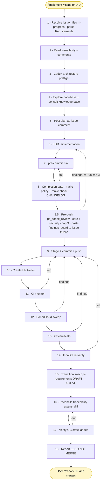

# Development Workflow

This documents the automated development workflow using Claude Code with the `/implement` skill. The workflow takes a Ground Control requirement from plan through PR-ready with a single skill invocation.

## Prerequisites

### GPG Signing
- GPG key `B47C8B1F62CC2B54` has no passphrase (removed 2026-03-31)
- Commits are signed non-interactively by Claude Code
- Global deny rules and blocking hooks were removed to enable this

### OpenTelemetry Observability
- OTEL collector runs as a Docker container at `~/.claude/telemetry/`
- Config: `~/.claude/telemetry/otel-collector-config.yaml`
- Compose: `~/.claude/telemetry/docker-compose.yml`
- Output: `~/.claude/telemetry/data/claude-code.jsonl`
- Rotation: 100MB max, 90-day retention, 10 backups
- Start: `cd ~/.claude/telemetry && docker compose up -d`
- Analyze: `~/.claude/telemetry/claude-metrics`

Env vars in `~/.claude/settings.json`:
```
OTEL_LOGS_EXPORTER=otlp
OTEL_LOG_TOOL_DETAILS=1
OTEL_EXPORTER_OTLP_ENDPOINT=http://localhost:4317
```

### Codex CLI
- OpenAI Codex CLI (`codex-cli`) installed at `~/.nvm/versions/node/v25.8.1/bin/codex`
- Used for architecture preflight and cross-model code review via Ground Control MCP workflow tools

## Workflow: `/implement <issue-number | requirement-uid>`

Every `/implement` run is driven by a GitHub issue. The issue is the durable artifact that records why the change is being made, which requirements are in scope (if any), and what acceptance looks like. You invoke the skill in either of two ways:

- **`/implement 123`** or **`/implement #123`** — implement GitHub issue #123 in the current repo. The issue body may declare in-scope requirements under a `## Requirements` section (a bulleted list of UIDs). The skill parses that section and carries the list through clause verification, traceability reconciliation, and status transitions. If the section is absent or empty, the run is treated as a bug fix / refactor / maintenance change with no formal requirements — traceability is still reconciled against the diff, but no requirement is transitioned to `ACTIVE`.
- **`/implement GC-X042`** — implement a requirement by UID. The skill finds the open GitHub issue linked to that requirement via traceability (`artifact_type: GITHUB_ISSUE`); if no such issue exists, it creates one via `gc_create_github_issue` and adds the UID to its `## Requirements` section. From that point forward the run is identical to the first form — the issue becomes the authoritative input.

Grouped implementation — shipping several related requirements in one PR — is expressed by listing all of them under `## Requirements` in a single issue body. One issue → one `/implement` run → one PR → N requirements transitioned to `ACTIVE` in the same commit stream. Do NOT spin up one issue per requirement when they belong together; the grouping is what makes the review boundary coherent.

Repo-local Ground Control project context comes from a `.ground-control.yaml` file at the repo root (with larger rule files under `.gc/`), not from `AGENTS.md` inline YAML or hardcoded assumptions in the skill. The workflow validates this via `gc_get_repo_ground_control_context` before it starts implementation — that call returns the project id, workflow commands, SonarCloud settings, and plan rules in a single response. It should:
- use the repo's configured Ground Control `project` when present
- treat inputs like `OBS-001`, `DSL-101`, `API-412`, or `GC-J001` as already-complete UIDs
- avoid guessing a prefix from the repository name

Recommended `.ground-control.yaml` convention:

```yaml
project: aces-sdl
```

`AGENTS.md` should still carry a brief `Ground Control Context` section that points agents at `.ground-control.yaml` and `.gc/`, so repo newcomers know where the workflow config lives.

### User Touchpoint

Per ADR-029, the workflow has **one** synchronous human touchpoint: PR review and merge to `dev`. Plans are posted to the GitHub issue thread as comments and the agent proceeds without waiting; review findings and decisions on findings are also recorded on the issue thread. Everything before merge is automated.

### High-level flow



**How it reads:**

- **Yellow** nodes are user touchpoints. Per ADR-029, the workflow has **one** synchronous human touchpoint: PR merge (the `End` node). Plans are posted to the GitHub issue thread (S5) and the agent proceeds without waiting; review findings and decisions on findings are also recorded on the issue thread.
- **Entry is always by issue.** Step 1 resolves the input to a GitHub issue (either directly or via a UID → issue shim) and parses the `## Requirements` section from the issue body into `in_scope_requirements[]`. The list may be empty (bug fix / refactor) or contain one or many UIDs (grouped implementation). Everything downstream treats the issue as the authoritative context and the list as the set of requirements to be transitioned to `ACTIVE` on completion. Step 1 also flags the resolved issue **in-progress** — an `in-progress` label (created on demand if the repo lacks it) plus a pickup comment on the thread recording the driver, the checked-out branch, and a timestamp — so a maintainer scanning `/issues`, or another agent, sees at a glance that work is underway. The label is removed when Step 18 closes the issue; a run that escalates to the user without completing intentionally leaves it set, because the issue *was* picked up.
- **Steps 1–4** gather context and run the codex architecture preflight before any code is written. Step 4 also consults the repo knowledge base via the index if one is present.
- **Step 6** is TDD (red → green → refactor per clause). Steps 7–8 are the local quality gate. A narrow documentation-only carve-out is documented in `skills/implement/SKILL.md` Step 4.4 for diffs that contain no executable behavior and whose claims are protected by an existing structural gate (policy check, schema validator, lint rule, verifier script). The carve-out must be declared in the plan and re-stated as an issue comment naming the gate; substring/snapshot tests written only to satisfy TDD wording are explicitly disallowed. The completion gate re-validates the carve-out with a two-check sweep over the union of committed, staged, unstaged, and untracked paths (Step 6 runs before stage-and-commit, so working-tree state is part of the diff): every path must be in the documentation set AND every diff hunk's content must be free of executable behavior — a path check alone isn't enough, because a doc file can still carry executable behavior.
- **Step 8.5 (= SKILL Step 6.5)** is the single Codex review pass per issue #804 — `gc_codex_review` with `uncommitted=true` runs locally against the staged + unstaged diff and posts a verbatim findings record to the resolved issue thread for each cycle (durable per ADR-029). Hard-cap is 3 cycles **per issue** (the cycle counter is anchored to the GitHub issue thread; the current branch is recorded in the marker for audit context but is NOT part of the cap key, so a branch rename on the same issue cannot reset the counter — see ADR-029). After a cycle's findings are surfaced, the agent fixes locally, re-stages, and re-invokes — no commit/push between cycles. The post-push codex review (former Step 12 in earlier numbering) was removed by issue #804 — merge-commit drift is the responsibility of CI (compile/tests/integration) and SonarCloud (quality).
- **Steps 9–12** commit, push, open the PR, and block on CI + SonarCloud before any reviewer looks at the code.
- **Steps 13–14** are the post-push review phase: `/review-tests` catches false-assurance tests, then one final CI pass closes out.
- **Step 15 transitions each in-scope requirement to `ACTIVE`.** This MUST happen BEFORE Step 16's traceability reconciliation: the Ground Control API enforces `IMPLEMENTS-only-on-ACTIVE`, so reconciling first against a still-DRAFT requirement silently fails. Forward-looking requirements (the diff documents/references but does not deliver) stay DRAFT and use `DOCUMENTS` links instead in Step 16.
- **Step 16 is traceability reconciliation, not link creation.** It walks every added/modified/renamed/deleted file in the diff, finds existing IMPLEMENTS/TESTS links pointing at each, and updates/deletes/creates links so the Ground Control graph matches reality after the change. Runs with zero in-scope requirements still reconcile, because a bug fix may have touched files linked to other requirements whose links are now stale. Deleting the sole implementation of a requirement is escalated to the user rather than silently removing the link. When the diff *finalizes* a requirement (e.g., an ADR clarification or CHANGELOG entry that ships the requirement) but the structural implementation lives in pre-existing files shipped under a sibling requirement, Step 16 backfills IMPLEMENTS links onto those pre-existing artifacts of record. The backfill is bounded by the requirement's concrete subject matter — not a whole-repo scan.
- **Step 17** re-verifies Ground Control state matches reality after Steps 15–16. These three steps run LAST, after every reviewer has signed off, so Ground Control never runs ahead of code that hasn't passed review. Zero in-scope requirements → Step 15 is a no-op; Step 16 still reconciles; Step 17 still audits.
- **Every downstream failure loops back to step 9** (stage + commit + push), which is the single re-entry point for fix commits. The completion gate (step 8), the pre-push codex review (step 8.5), and the GC verify (step 17) are the loops that target earlier steps, because they correspond to local-only / pre-PR / GC-only state respectively.

Claude does NOT merge. The user reviews the PR and merges.

## Review Pipeline

One mandatory pre-implementation architecture pass, then a single pre-push codex review pass (Step 6.5), then test-quality review before the user sees the PR. The post-push codex review (former Step 12) was removed by issue #804 — the canonical codex pass is the pre-push one, which catches everything codex would normally flag while collapsing the asymmetric "post-push finding → guaranteed CI/SonarCloud roundtrip" cost. Merge-commit drift relative to base is the responsibility of CI (compile/tests/integration) and SonarCloud (quality), not a separate codex pass.

| Stage | What it catches | How it runs |
|-------|-----------------|-------------|
| Codex architecture preflight | Cross-cutting concerns, reuse opportunities, abstraction/concept confusion, need for ADR/design guidance before coding | `gc_codex_architecture_preflight` |
| SonarCloud | Coverage, code smells, duplication, security hotspots, open issues on the PR | CI job + `$SONAR_TOKEN` sweep of `api/issues/search` and `api/hotspots/search` for this PR |
| Trivy (advisory) | Container image vulnerabilities, Dockerfile/IaC misconfigurations, in-image secrets | CI job; SARIF artifact `trivy-sarif` on the workflow run page; non-blocking |
| OSV-scanner (advisory) | CVEs in Java/Gradle dependencies (read from `backend/gradle.lockfile`) | CI job; SARIF artifact `osv-scanner-sarif` on the workflow run page; non-blocking |
| Codex review (pre-push, Step 6.5) | Fitness for purpose, architectural soundness, maintainability, extensibility, security, established patterns, consistency with the larger codebase. Codex returns structured findings; the MCP server posts a verbatim findings record to the resolved issue thread from the host side; the coding agent fixes locally and re-runs the review. There is no PR yet at Step 6.5, so no inline PR comments are written by the SKILL — inline anchored comments only happen if a direct caller invokes `gc_codex_review` post-push (with a `pr_number`), which the SKILL no longer drives (issue #804). | `gc_codex_review` (`uncommitted=true`); MCP posts the issue-thread findings record |
| `/review-tests` | Assertion-free tests, mock-only assertions, integration-as-unit, tests that can't detect regressions | `Skill("review-tests")` |

All preflight/review stages operate under the same rule: **fix everything, defer nothing.** Review-loop cap (per #804): 3 cycles per reviewer; per-finding `gc_codex_verify_finding` cap stays at 2. If a fourth cycle would be needed, the skill escalates to the user with the full finding history.

"Defer nothing" is mechanically enforced (issue #830, ADR-029 § "`defer` is not a valid disposition"): the `.claude/hooks/block-defer-language.py` PreToolUse hook blocks `gh issue/pr {create,edit,comment,close}` calls carrying deferral-disposition language ("deferred to a follow-up PR", "addressed in a subsequent PR", "TBD later" in a closing comment, …), and `bin/policy` flags the same language in the PR body at completion gate. Filing a tracking issue does not convert a deferral into a valid disposition — the only valid ones are `fix`, `wontfix` (with explicit user authorization), or `not-applicable` (with rationale). Codex review additionally classifies each finding `one-off` or `class`; a `class` finding must be fixed at the **category** level (a structural gate / shared helper / parameterization — one point of repair applied to every instance), not whack-a-mole'd to the reviewer-named site.

## Guardrails

### Deny Rules (`~/.claude/settings.json`)
- `Bash(gh pr merge*)` — Claude cannot merge PRs
- `Bash(gh api */merge*)` — Claude cannot merge via API
- `Bash(git merge *)` — Claude cannot merge branches

### Attribution (`~/.claude/settings.json`)
```json
"attribution": { "commit": "", "pr": "" }
```
No Co-Authored-By, no "Generated with Claude Code", no AI attribution anywhere.

### Workflow Hooks (source of truth: `.claude/hooks/`)

The three user-level workflow hooks listed below are **checked into this repo** under `.claude/hooks/` and installed as **real file copies** at `~/.claude/hooks/<name>` by `scripts/bootstrap-claude-workflow.sh` (see **Tooling** below). Unlike skills — which are symlinked so edits in the repo take effect on the next session — hooks are copied because the harness execs them on every Bash tool call in every Claude Code session on the host. If the runtime path were a symlink into this repo's working tree, any `git checkout` in this repo would silently break hooks for every concurrent Claude window on the machine. Real copies decouple runtime from worktree state.

After editing a hook file under `.claude/hooks/` in the repo, re-run `scripts/bootstrap-claude-workflow.sh` (no arguments, idempotent) to copy the new version into `~/.claude/hooks/`. The `~/.claude/settings.json` hook registrations point at the stable `~/.claude/hooks/<name>` path and work regardless of what this repo is checked out to.

One user-level hook is deliberately NOT in the repo: `~/.claude/hooks/block-break-system-packages.sh`. It's a generic pip/apt safety gate unrelated to the Ground-Control workflow, so it stays host-local and `bootstrap-claude-workflow.sh` leaves it alone.

#### Stop Hook — `verify-implementation.sh`
Blocks Claude from completing, but **only when `/implement` was invoked in the current session**. Scoped by process ID (`$PPID`) so concurrent Claude windows on the same branch don't interfere.

Universal checks (all repos):
- CHANGELOG not updated (when source files changed)

Project-specific checks (`.claude/hooks/verify-extra.sh`, sourced if present):
- shared repo-native policy script (`bin/policy`) over the changed-file set

The hook no longer enforces `/review` and `/security-review` — those were removed from the `/implement` skill in favor of `gc_codex_review` + `/review-tests`. The `/implement` skill itself is the enforcement point for review coverage; the hook only guards the CHANGELOG + repo policy.

#### Skill Call Logging — `log-skill-call.sh`
PostToolUse hook on `Skill` — writes JSONL to `/tmp/claude-skill-log/<PID>.jsonl` (per-session, not per-branch). The Stop hook previously read this log to verify `/review` and `/security-review` were actually invoked; it's still wired up for forward compat in case we reintroduce skill-based checks. Stale logs (>24h) are auto-pruned.

#### Git Merge Guard — `git-merge-guard.py`
PreToolUse hook on `Bash`. The user owns every actual merge. Blocked unconditionally: `git merge`, `gh pr merge`, `git reset --hard`, and a plain `git push --force` / `git push -f`. A `git push --force-with-lease` to a *feature* branch is allowed — that's the rebase-feature-branch-onto-base-then-update-the-PR flow — but a force-push of any kind to a ref named `main` or `dev` is blocked.

### Repo-Native Policy Layer

- `architecture/policies/adr-policy.json` defines machine-readable ADR guardrails
- `python3 bin/policy` enforces ADR/workflow, controller/MCP/docs, migration, and PR-body policy
- `make policy` is the common path for Claude, Codex, pre-commit, and CI
- `make sync-ground-control-policy` and `make policy-live` keep Ground Control quality gates and ADR metadata aligned when a live GC instance is available

## Standalone Skills

Workflow skills live in **two** repo roots, each with its own installer. The two name sets are disjoint, so the two install paths can never resolve the same name to different definitions:

- **`skills/<name>/SKILL.md`** — agent-neutral skills shared by Claude Code *and* Codex (per ADR-027). `bin/install-skills.sh` installs each into `~/.claude/skills/<name>`, `~/.codex/skills/<name>`, and (legacy alias) `~/.codex/prompts/<name>.md`.
- **`.claude/skills/<name>/SKILL.md`** — Claude-Code-only skills. `scripts/bootstrap-claude-workflow.sh` symlinks each into `~/.claude/skills/<name>` (see **Tooling** below).

In both cases this repo is the source of truth: edit the `SKILL.md`, commit, and the change takes effect for the next Claude Code (or Codex) session on a host whose install paths are symlinks into the repo. Re-run the relevant installer after a host reset.

| Skill | Repo root | Purpose |
|-------|-----------|---------|
| `/implement <issue-number \| uid>` | `skills/` | Full end-to-end: plan through PR-ready |
| `/review-tests` | `skills/` | Test-quality review — catches false-assurance tests |
| `/ship` | `.claude/skills/` | Ship an already-committed branch (CI, reviews, fix, report) |
| `/stage` | `.claude/skills/` | Stage files + pre-commit loop |
| `/gh-workflow-monitor` | `.claude/skills/` | Monitor GitHub Actions workflow runs |
| `/repo-setup` | `.claude/skills/` | Set up branch protection + pre-commit + SonarQube wiring on a fresh repo |
| `/wave-issue-coverage` | `.claude/skills/` | Back-fill GitHub issues for a wave's DRAFT requirements |

## Tooling

Repo-local scripts live under `scripts/` (bash) and `bin/` (Python). The ones you're most likely to run by hand:

| Command | Purpose |
|---------|---------|
| `scripts/bootstrap-claude-workflow.sh` | Wire the Claude-Code-only surfaces from `~/.claude/`: the `.claude/skills/<name>/` skills (symlinked — edit takes effect live) and the `WORKFLOW_HOOKS` allowlist under `.claude/hooks/` (**copied** as real files so runtime does not depend on which branch this repo is checked out to). Idempotent; safe to re-run. Pass `--dry-run` to preview, `--force` to clobber non-matching host content. The hook allowlist is explicit, so generic host-local hooks (e.g. `block-break-system-packages.sh`) are left alone. Re-run after editing a hook file in the repo to push the new version into `~/.claude/hooks/`. Does **not** touch the `skills/<name>/` agent-neutral skills — that's `bin/install-skills.sh`'s job. |
| `bin/install-skills.sh` | Install the agent-neutral `skills/<name>/` skills (`/implement`, `/review-tests`) into `~/.claude/skills/<name>`, `~/.codex/skills/<name>`, and `~/.codex/prompts/<name>.md` (legacy alias). Symlinks by default (`--copy` to hard-copy, `--dry-run` to preview, `--no-codex` to skip the Codex targets, `--force` to overwrite divergent host content). Idempotent; refuses to clobber unmanaged host targets without `--force`. |
| `scripts/pack-sync.sh` | Trigger the `pack-registry-sync` GitHub workflow against this repo. |
| `bin/policy` | Run the repo-native policy guardrails (ADR sync, controller/MCP/docs parity, migration policy, PR-body checks). Invoked by `make policy`, pre-commit, and CI. |
| `bin/adr-guard` | ADR-specific policy checks run standalone. |
| `bin/scaffold-controller`, `bin/scaffold-audited-entity`, `bin/scaffold-l2-state-machine` | Generators that start new code from a compliant shape. Wrapped by `make scaffold-*`. |
| `bin/check-pr-body` | Validate a PR body against the required template. |

### Bootstrapping a fresh host

After cloning this repo onto a new host (or after any `rm -rf ~/.claude/skills/` or `rm -rf ~/.claude/hooks/` reset), run **both** installers:

```
scripts/bootstrap-claude-workflow.sh   # .claude/skills/* skills + the WORKFLOW_HOOKS allowlist under .claude/hooks/
bin/install-skills.sh                  # skills/* (agent-neutral) into ~/.claude/skills, ~/.codex/skills, ~/.codex/prompts
```

`scripts/bootstrap-claude-workflow.sh` walks:
- `.claude/skills/*/` — every skill directory gets a matching `~/.claude/skills/<name>` **symlink**. Editing a skill in the repo takes effect immediately in the next session.
- `.claude/hooks/` — only the hooks listed in the script's `WORKFLOW_HOOKS` allowlist (`git-merge-guard.py`, `block-defer-language.py`, `log-skill-call.sh`, `verify-implementation.sh`) are installed as **real file copies** at `~/.claude/hooks/<name>`. Editing a hook in the repo requires re-running this script to push the new version out. Repo-scoped hooks (`protect_files.sh`, `verify-extra.sh`) stay where they are because they're wired via `$CLAUDE_PROJECT_DIR` in `.claude/settings.json`, not via `~/.claude/`.

`bin/install-skills.sh` symlinks each `skills/<name>/` directory (the agent-neutral skills shared with Codex — `/implement`, `/review-tests`) into `~/.claude/skills/<name>`, `~/.codex/skills/<name>`, and `~/.codex/prompts/<name>.md`. Pass `--no-codex` if Codex isn't on the host.

If a pre-existing host file or directory has local changes that are NOT in the repo, the script refuses to clobber it and exits non-zero — re-run with `--force` only after you've confirmed the repo copy is the version you want. Already-correct entries are left alone.

## Key Lessons (from GC-J001 first run)

- **Write `@WebMvcTest` controller tests**, not just integration tests. SonarCloud CI doesn't run Testcontainers.
- **Update `MigrationSmokeTest` and `RequirementsE2EIntegrationTest`** version lists when adding migrations.
- **Add `@NotAudited` to `@ManyToOne` references** to non-audited entities when using `@Audited`.
- **Add `_audit` table migration** when adding `@Audited` entities.
- **Default durable mutable entities to `BaseEntity`**. Only keep standalone lifecycle fields for intentionally append-only, snapshot, cache, or import/audit records.
- **Use the scaffold commands** (`make scaffold-controller`, `make scaffold-audited-entity`, `make scaffold-l2-state-machine`) to start from a compliant shape.
