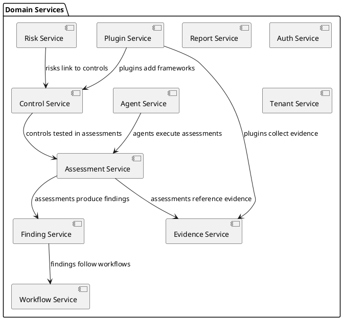

# Ground Control — System Architecture

**Version:** 1.0.0
**Date:** 2026-03-07

---

## 1. Architecture Principles

| Principle | Rationale |
|---|---|
| **API-First** | Every capability exposed via versioned API before building UI |
| **Plugin-Extensible** | Core is lean; frameworks, integrations, and workflows are plugins |
| **Agent-Ready** | AI agents are first-class consumers of every API surface |
| **Multi-Tenant** | Logical or physical tenant isolation; configurable per deployment |
| **Self-Hostable** | Runs on a single machine (Docker Compose) or scales to Kubernetes |
| **Event-Driven** | State changes publish domain events for async processing |
| **Secure by Default** | Encryption at rest and in transit; RBAC + ABAC; immutable audit log |

---

## 2. High-Level System Architecture

```
┌─────────────────────────────────────────────────────────────────────┐
│                         CLIENTS                                     │
│  ┌──────────┐  ┌──────────┐  ┌──────────┐  ┌──────────────────┐   │
│  │  Web UI   │  │ Agent SDK│  │  CLI     │  │ External Systems │   │
│  │ (SPA)     │  │ (Py/TS)  │  │          │  │ (Webhooks/API)   │   │
│  └─────┬─────┘  └─────┬────┘  └────┬─────┘  └────────┬─────────┘   │
│        │              │             │                  │             │
└────────┼──────────────┼─────────────┼──────────────────┼─────────────┘
         │              │             │                  │
         ▼              ▼             ▼                  ▼
┌─────────────────────────────────────────────────────────────────────┐
│                      API GATEWAY / LOAD BALANCER                    │
│  ┌─────────────────────────────────────────────────────────────┐   │
│  │  Rate Limiting │ Auth (JWT) │ CORS │ Request Routing        │   │
│  └─────────────────────────────────────────────────────────────┘   │
└────────────────────────────┬────────────────────────────────────────┘
                             │
                             ▼
┌─────────────────────────────────────────────────────────────────────┐
│                     APPLICATION LAYER                                │
│                                                                     │
│  ┌──────────────────┐  ┌──────────────────┐  ┌──────────────────┐  │
│  │  REST API Server  │  │ GraphQL Server   │  │  Webhook Ingress │  │
│  │  (OpenAPI 3.1)    │  │                  │  │                  │  │
│  └────────┬─────────┘  └────────┬─────────┘  └────────┬─────────┘  │
│           │                     │                      │            │
│           ▼                     ▼                      ▼            │
│  ┌─────────────────────────────────────────────────────────────┐   │
│  │                    DOMAIN SERVICE LAYER                      │   │
│  │                                                             │   │
│  │  ┌─────────┐ ┌─────────┐ ┌──────────┐ ┌─────────────────┐ │   │
│  │  │  Risk    │ │ Control │ │Assessment│ │   Evidence      │ │   │
│  │  │  Service │ │ Service │ │ Service  │ │   Service       │ │   │
│  │  └─────────┘ └─────────┘ └──────────┘ └─────────────────┘ │   │
│  │  ┌─────────┐ ┌─────────┐ ┌──────────┐ ┌─────────────────┐ │   │
│  │  │ Finding │ │ Report  │ │ Workflow │ │   Agent         │ │   │
│  │  │ Service │ │ Service │ │ Service  │ │   Service       │ │   │
│  │  └─────────┘ └─────────┘ └──────────┘ └─────────────────┘ │   │
│  │  ┌─────────┐ ┌─────────┐ ┌──────────┐                     │   │
│  │  │ Auth    │ │ Tenant  │ │ Plugin   │                     │   │
│  │  │ Service │ │ Service │ │ Service  │                     │   │
│  │  └─────────┘ └─────────┘ └──────────┘                     │   │
│  └─────────────────────────────────────────────────────────────┘   │
│                             │                                       │
│                             ▼                                       │
│  ┌─────────────────────────────────────────────────────────────┐   │
│  │                    EVENT BUS (Internal)                      │   │
│  │  Domain events: risk.created, control.updated, test.completed│  │
│  └─────────────────────────────────────────────────────────────┘   │
│                             │                                       │
│                             ▼                                       │
│  ┌─────────────────────────────────────────────────────────────┐   │
│  │                   PLUGIN RUNTIME                             │   │
│  │  ┌──────────┐ ┌──────────┐ ┌──────────┐ ┌──────────┐      │   │
│  │  │ Framework│ │Integration│ │ Evidence │ │ Custom   │      │   │
│  │  │ Plugins  │ │ Plugins  │ │ Collectors│ │ Workflow │      │   │
│  │  └──────────┘ └──────────┘ └──────────┘ └──────────┘      │   │
│  └─────────────────────────────────────────────────────────────┘   │
└────────────────────────────┬────────────────────────────────────────┘
                             │
                             ▼
┌─────────────────────────────────────────────────────────────────────┐
│                     DATA & STORAGE LAYER                            │
│                                                                     │
│  ┌──────────────┐  ┌──────────────┐  ┌──────────────────────────┐  │
│  │  PostgreSQL   │  │  Object Store │  │  Search Index            │  │
│  │  (Primary DB) │  │  (S3/MinIO)   │  │  (Meilisearch/Typesense)│  │
│  └──────────────┘  └──────────────┘  └──────────────────────────┘  │
│  ┌──────────────┐  ┌──────────────┐                                │
│  │  Redis/Valkey │  │  Audit Log   │                                │
│  │  (Cache/Queue)│  │  (Append-Only)│                               │
│  └──────────────┘  └──────────────┘                                │
└─────────────────────────────────────────────────────────────────────┘
```

---

## 3. Component Descriptions

### 3.1 API Gateway

The API gateway is the single entry point for all clients. Responsibilities:
- **Authentication** — Validates JWT access tokens (issued by Auth Service)
- **Rate Limiting** — Per-tenant and per-client throttling
- **CORS** — Configurable origin policies
- **Request Routing** — Routes to REST, GraphQL, or Webhook handlers
- **TLS Termination** — TLS 1.3 for all external connections

Technology: Nginx/Envoy/Caddy (configurable) or cloud-native (ALB/Cloud Run).

### 3.2 REST API Server

OpenAPI 3.1 specification. Versioned at `/api/v1/`. Resources:

| Resource | Endpoint Pattern |
|---|---|
| Risks | `/api/v1/risks` |
| Controls | `/api/v1/controls` |
| Frameworks | `/api/v1/frameworks` |
| Assessments | `/api/v1/assessments` |
| Test Procedures | `/api/v1/test-procedures` |
| Evidence/Artifacts | `/api/v1/artifacts` |
| Findings | `/api/v1/findings` |
| Users | `/api/v1/users` |
| Agents | `/api/v1/agents` |
| Plugins | `/api/v1/plugins` |
| Audit Logs | `/api/v1/audit-logs` |
| Reports | `/api/v1/reports` |
| Taxonomy | `/api/v1/taxonomy` |

All endpoints support: pagination, filtering, sorting, field selection, and `include` for related entities.

### 3.3 GraphQL Server

Optional GraphQL endpoint at `/graphql` for complex relational queries (e.g., "give me all controls mapped to SOX with their latest test results and linked findings"). Shares the same domain services as REST.

### 3.4 Domain Services

Each service encapsulates a bounded context:



**Service responsibilities:**

| Service | Responsibility |
|---|---|
| **Risk Service** | CRUD risks, scoring, treatment plans, heat maps, risk campaigns |
| **Control Service** | CRUD controls, CCL, framework mappings, control catalog |
| **Assessment Service** | Campaigns, test procedures, workpapers, sampling |
| **Evidence Service** | Artifact storage, linking, evidence requests, lineage, retention |
| **Finding Service** | Finding lifecycle, remediation tracking, deficiency classification |
| **Report Service** | Report generation, templates, scheduling, export |
| **Workflow Service** | Review chains, approval logic, state machine, notifications |
| **Agent Service** | Agent registration, assignments, result intake, provenance |
| **Auth Service** | Authentication (local, SAML, OIDC), authorization (RBAC+ABAC), tokens |
| **Tenant Service** | Tenant lifecycle, isolation, configuration, resource limits |
| **Plugin Service** | Plugin lifecycle, sandboxing, configuration, hook registration |

### 3.5 Event Bus

Internal event bus for decoupling domain services. Supports:

- **Synchronous handlers** (in-process, for simple reactions)
- **Async queue** (Redis/Valkey streams or PostgreSQL LISTEN/NOTIFY for background jobs)

**Core domain events:**

| Event | Published By | Consumed By |
|---|---|---|
| `risk.created` | Risk Service | Workflow, Notification |
| `risk.score_changed` | Risk Service | Report, Dashboard cache |
| `control.updated` | Control Service | Assessment, Search Index |
| `assessment.completed` | Assessment Service | Report, Finding |
| `test_procedure.result_submitted` | Assessment Service | Workflow, Agent Service |
| `artifact.uploaded` | Evidence Service | Search Index, Lineage |
| `finding.opened` | Finding Service | Workflow, Notification |
| `finding.closed` | Finding Service | Report, Risk Service |
| `agent.result_submitted` | Agent Service | Workflow (route to review) |
| `plugin.installed` | Plugin Service | Tenant Service |

### 3.6 Plugin Runtime

Plugins extend Ground Control without modifying core code.

```
┌────────────────────────────────────────────────┐
│               Plugin Runtime                    │
│                                                │
│  ┌──────────────────┐  ┌───────────────────┐   │
│  │ Plugin Sandbox    │  │ Plugin Registry   │   │
│  │ (Process Isolation│  │ (Catalog, Versions│   │
│  │  or WASM)         │  │  Signatures)      │   │
│  └──────────────────┘  └───────────────────┘   │
│                                                │
│  Plugin API Surface:                           │
│  ├── Hook into domain events                   │
│  ├── Register new API endpoints                │
│  ├── Add UI components (micro-frontend)        │
│  ├── Define new entity types                   │
│  ├── Provide framework definitions             │
│  └── Access scoped data via Plugin SDK         │
│                                                │
│  Security:                                     │
│  ├── Signed packages (Ed25519)                 │
│  ├── Declared permission scopes                │
│  ├── Resource limits (CPU, memory, API calls)  │
│  └── Audit logging of plugin actions           │
└────────────────────────────────────────────────┘
```

**Plugin types:**

| Type | Purpose | Example |
|---|---|---|
| **Framework Plugin** | Adds a compliance framework definition | ISO 27001, PCI-DSS, HIPAA |
| **Integration Plugin** | Connects to external systems | Jira, ServiceNow, Slack |
| **Evidence Collector** | Automates evidence gathering | AWS Config, Azure Policy |
| **Workflow Plugin** | Custom approval/review workflows | SOX sign-off chain |
| **Report Plugin** | Custom report templates or formats | Board report, regulator format |
| **Agent Plugin** | Agent capabilities (scoring models, analyzers) | FAIR quantitative scoring |

### 3.7 Data & Storage Layer

| Store | Technology | Purpose |
|---|---|---|
| **Primary Database** | PostgreSQL 16+ | All structured data, JSONB for flexible attributes |
| **Object Store** | S3-compatible (S3, MinIO, GCS) | Evidence artifacts, report exports, attachments |
| **Cache / Queue** | Redis or Valkey | Session cache, rate limit counters, background job queue |
| **Search Index** | Meilisearch or Typesense | Full-text search across risks, controls, evidence, findings |
| **Audit Log** | PostgreSQL (append-only table) or external (immutable ledger) | Compliance audit trail |

---

## 4. Authentication & Authorization Architecture

```
┌───────────────────────────────────────────────────────────────┐
│                    Authentication Flow                         │
│                                                               │
│  Browser ──┬── SAML 2.0 ──► Corporate IdP (Okta, Azure AD)  │
│            ├── OIDC ──────► Corporate IdP / Social           │
│            └── Local ─────► Username/Password + MFA          │
│                                                               │
│  Agent ───┬── OAuth2 Client Credentials ──► Token Endpoint   │
│           └── API Key ────────────────────► API Gateway       │
│                                                               │
│  All paths ──► JWT Access Token ──► API Gateway validates    │
└───────────────────────────────────────────────────────────────┘

┌───────────────────────────────────────────────────────────────┐
│                    Authorization Model                         │
│                                                               │
│  RBAC (Role-Based Access Control):                           │
│  ├── Roles: Admin, Risk Manager, Auditor, Control Owner,     │
│  │          Compliance Analyst, Viewer, Agent                 │
│  └── Each role has a set of permissions (resource:action)     │
│                                                               │
│  ABAC (Attribute-Based Access Control):                      │
│  ├── Tenant isolation (tenant_id on every resource)          │
│  ├── Business unit scoping (user sees only their BU data)    │
│  ├── Assessment scoping (auditor sees only assigned work)    │
│  └── Data classification (restrict PII/sensitive artifacts)  │
│                                                               │
│  Permission format: resource:action:scope                     │
│  Examples:                                                    │
│  ├── risks:read:* (read all risks)                           │
│  ├── risks:write:bu=engineering (write risks in Engineering) │
│  ├── assessments:approve:campaign=Q1-2026 (approve in Q1)   │
│  └── agents:execute:scope=testing (agent can run tests)      │
└───────────────────────────────────────────────────────────────┘
```

---

## 5. Deployment Architecture

### 5.1 Single-Machine (Docker Compose)

For small teams or evaluation:

```
┌────────────────────────────────────────────┐
│  Docker Compose Host                        │
│                                            │
│  ┌──────────┐  ┌──────────┐  ┌──────────┐ │
│  │ GC App   │  │PostgreSQL│  │  MinIO   │ │
│  │ (API+UI) │  │          │  │          │ │
│  └──────────┘  └──────────┘  └──────────┘ │
│  ┌──────────┐  ┌──────────┐               │
│  │  Redis   │  │Meilisearch│              │
│  └──────────┘  └──────────┘               │
│                                            │
│  Reverse Proxy: Caddy (auto TLS)          │
└────────────────────────────────────────────┘
```

### 5.2 Kubernetes (Helm Chart)

For production and multi-tenant:

```
┌─────────────────────────────────────────────────────────────────┐
│  Kubernetes Cluster                                             │
│                                                                 │
│  ┌─────────────┐     ┌─────────────┐     ┌─────────────┐      │
│  │  Ingress     │     │  GC API     │     │  GC Worker  │      │
│  │  Controller  │────▶│  Deployment │     │  Deployment │      │
│  │  (nginx/     │     │  (N replicas)│    │  (background│      │
│  │   traefik)   │     └─────────────┘     │   jobs)     │      │
│  └─────────────┘            │              └─────────────┘      │
│                             │                    │               │
│                             ▼                    ▼               │
│                    ┌─────────────┐     ┌─────────────┐         │
│                    │  PostgreSQL │     │  Redis      │         │
│                    │  (Operator  │     │  (Sentinel) │         │
│                    │   or RDS)   │     └─────────────┘         │
│                    └─────────────┘                              │
│                    ┌─────────────┐     ┌─────────────┐         │
│                    │  MinIO /    │     │ Meilisearch │         │
│                    │  S3         │     │             │         │
│                    └─────────────┘     └─────────────┘         │
│                                                                 │
│  ┌─────────────────────────────────────────────────────────┐   │
│  │  Shared: ConfigMaps, Secrets, PVCs, NetworkPolicies     │   │
│  └─────────────────────────────────────────────────────────┘   │
└─────────────────────────────────────────────────────────────────┘
```

### 5.3 Cloud-Managed

For organizations preferring managed services:

| Component | AWS | Azure | GCP |
|---|---|---|---|
| Compute | ECS Fargate / EKS | AKS / Container Apps | Cloud Run / GKE |
| Database | RDS PostgreSQL | Azure DB for PostgreSQL | Cloud SQL |
| Object Storage | S3 | Blob Storage | GCS |
| Cache | ElastiCache Redis | Azure Cache for Redis | Memorystore |
| Search | OpenSearch | Cognitive Search | (Meilisearch on GKE) |
| Load Balancer | ALB | Application Gateway | Cloud Load Balancing |
| Identity | Cognito / SAML | Azure AD / SAML | Identity Platform |

---

## 6. Security Architecture

### 6.1 Defense in Depth

```
Layer 1 — Network:     TLS 1.3, network segmentation, WAF
Layer 2 — Gateway:     Rate limiting, JWT validation, IP allowlisting
Layer 3 — Application: RBAC + ABAC, input validation, CSRF protection
Layer 4 — Data:        Encryption at rest (AES-256), field-level encryption for sensitive data
Layer 5 — Audit:       Immutable audit log, tamper detection, log forwarding to SIEM
Layer 6 — Supply:      Signed plugins, dependency scanning, SBOM generation
```

### 6.2 Data Protection

| Data Category | Protection |
|---|---|
| Credentials (passwords, API keys) | Argon2id hashing / encrypted secrets store |
| Evidence artifacts | AES-256 at rest; optional client-side encryption |
| PII in assessments | Field-level encryption; access restricted by ABAC policy |
| Audit logs | Append-only table; hash chaining for tamper detection |
| Database backups | Encrypted with customer-managed key (BYOK supported) |

### 6.3 Audit Log Architecture

```
┌─────────────────────────────────────────────────┐
│  Every State Change                              │
│                                                  │
│  {                                               │
│    "id": "uuid",                                │
│    "timestamp": "2026-03-07T10:15:30Z",         │
│    "tenant_id": "uuid",                         │
│    "actor_id": "uuid",                          │
│    "actor_type": "user | agent | system",       │
│    "action": "create | update | delete | ...",  │
│    "resource_type": "risk | control | ...",     │
│    "resource_id": "uuid",                       │
│    "changes": {                                 │
│      "field": { "old": "...", "new": "..." }    │
│    },                                           │
│    "ip_address": "198.51.100.42",               │
│    "user_agent": "...",                         │
│    "previous_hash": "sha256:...",               │
│    "hash": "sha256:..."                         │
│  }                                               │
│                                                  │
│  → Append-only PostgreSQL table                  │
│  → Optional: forward to Splunk/Elastic via       │
│    syslog or webhook                             │
└─────────────────────────────────────────────────┘
```

---

## 7. Technology Stack Summary

| Layer | Technology | Rationale |
|---|---|---|
| **Language** | Python 3.12+ (API), TypeScript (UI) | Strong ecosystem, AI/ML libraries, broad talent pool |
| **API Framework** | FastAPI | Async, OpenAPI auto-generation, Pydantic validation |
| **GraphQL** | Strawberry | Python-native, type-safe, integrates with FastAPI |
| **Web UI** | React + TypeScript | Component ecosystem, SSR capable, agent dashboard |
| **UI Framework** | Shadcn/ui + Tailwind CSS | Accessible, customizable, modern |
| **Database** | PostgreSQL 16+ | JSONB, full-text search, row-level security, proven |
| **ORM** | SQLAlchemy 2.0 + Alembic | Async support, migrations, mature |
| **Object Storage** | S3-compatible (MinIO for self-host) | Universal API, cost-effective, scalable |
| **Cache/Queue** | Redis or Valkey | Fast, versatile, stream support for job queues |
| **Search** | Meilisearch | Fast, typo-tolerant, easy to host, great UX |
| **Background Jobs** | ARQ (Redis-backed) or Celery | Reliable async task execution |
| **Containerization** | Docker + Docker Compose | Universal deployment format |
| **Orchestration** | Kubernetes (Helm chart) | Production scaling, managed K8s on all clouds |
| **CI/CD** | GitHub Actions | Widely adopted, free for open source |
| **Testing** | pytest + Playwright | Unit/integration + E2E |

---

## 8. Scalability Considerations

### 8.1 Horizontal Scaling

- **API servers** — Stateless; scale horizontally behind load balancer
- **Worker processes** — Scale independently based on job queue depth
- **PostgreSQL** — Read replicas for reporting; connection pooling (PgBouncer)
- **Object storage** — Inherently scalable (S3/MinIO)
- **Search** — Meilisearch clusters or multiple shards

### 8.2 Multi-Tenancy Models

| Model | Isolation | Complexity | Use Case |
|---|---|---|---|
| **Shared schema** (tenant_id column) | Logical | Low | SaaS, small tenants |
| **Schema per tenant** | Strong logical | Medium | Regulated industries |
| **Database per tenant** | Physical | High | High-security, large enterprises |

All models are supported; configurable at deployment time.

### 8.3 Performance Targets

| Operation | Target |
|---|---|
| API CRUD (single entity) | p95 < 100ms |
| API list with filters | p95 < 200ms |
| Report generation (standard) | p95 < 5s |
| Full-text search | p95 < 50ms |
| File upload (100MB) | p95 < 10s |
| Agent result submission | p95 < 150ms |
